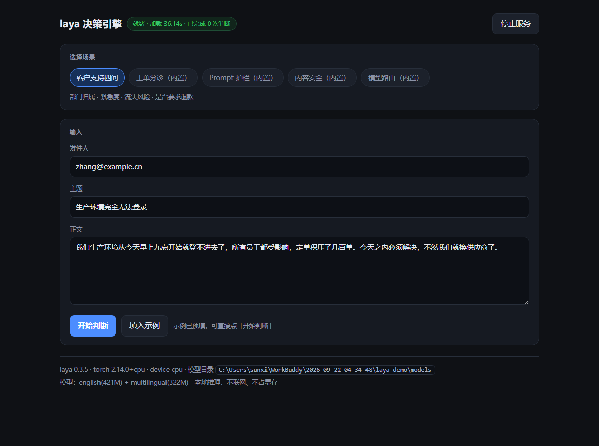
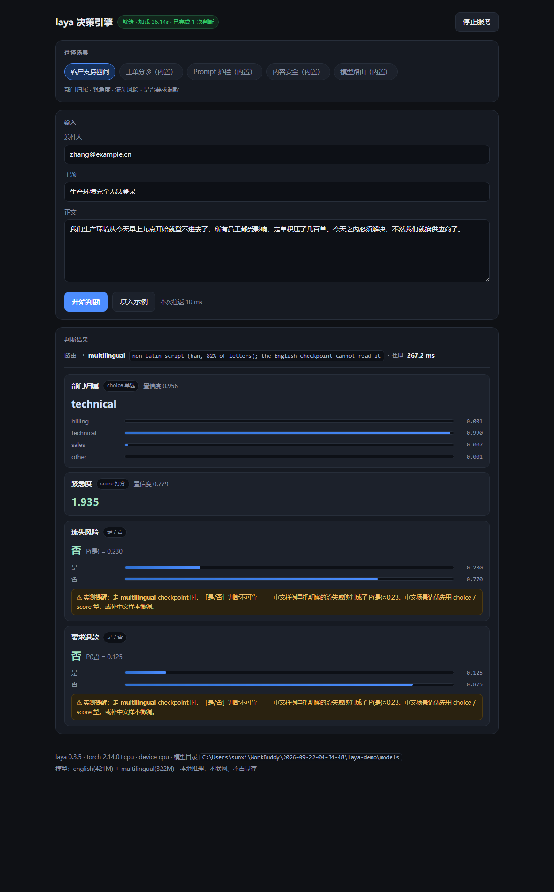

# laya-desktop

把 [laya](https://github.com/NandhaKishorM/laya)（非自回归 System-1 决策引擎）封装成 **Windows 独立桌面软件**。

- 本地运行，**不联网、不依赖 Python 安装**
- 两种形态：**浏览器操作台** 或 **pywebview 原生无边框窗口**
- 打包为 **onefile 单 exe** 或 **7z 自解压安装包**
- 内置五个场景：客户支持四问 / 工单分诊 / Prompt 护栏 / 内容安全 / 模型路由

## 目录

| 文件 | 作用 |
| --- | --- |
| `server.py` | 本地 HTTP 服务（127.0.0.1:8811）+ 操作台后端 |
| `app_native.py` | pywebview 原生窗口入口（关窗即退出） |
| `web/index.html` | 操作台前端 |
| `make_desktop.py` | PyInstaller `--onedir` 构建 |
| `make_desktop_onefile.py` | PyInstaller `--onefile --windowed` 构建 |
| `make_installer.py` | 7z 自解压安装包 |
| `demo_triage.py` / `verify_exe.py` | 实测 / 无头验证脚本 |
| `打包说明.md` | onedir 方案与坑 |
| `打包说明-原生窗口与安装包.md` | 原生窗口 + onefile + 安装包 完整方案/依赖/坑 |

## 模型权重

不入库（约 1.5GB）。从 HuggingFace `convaiinnovations/laya` 拉取，按以下结构放置后即可运行：

```
models/
  english/       # ModernBERT-large 421M
  multilingual/  # mmBERT-base 322M
```

## 操作台预览

两张截图来自无头渲染的操作台界面（与 pywebview 原生窗口内的 UI 一致，真机双击 `laya-desktop.exe` 即可见原生边框窗口）：





内置五个场景：客户支持四问 / 工单分诊 / Prompt 护栏 / 内容安全 / 模型路由；结果区展示 `choice` / `score` / `noul` 三类决策与概率条、路由语言与时延。

## 已知短板

`noul`（是/否判断）对**中文不可靠**，跨语言请用 `choice` / `score` 型。详见说明文档。

## 运行 / 打包

见 `打包说明-原生窗口与安装包.md`。
